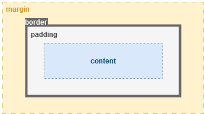

# CSS (Cascading Style Sheets)

* Mi a CSS?
* Selectorok és deklarációk
* CSS stílusok megadása inline (`style` attribútum), beágyazott (`<head>` > `<style>`), külső fájlból importált (`<link>`) módon
* CSS kommentek
* Kaszkádolás
* Hierarchia
* Elem, id, és class selectorok
* `span` és `div` elemek szerepe
* Háttér formázása
* `margin`, `padding`, és `border`
* Szélesség és magasság beállítása
* Szövegformázás, betűtípus beállításai (`font-family`, `font-size`, félkövér, aláhúzott, dőlt, stb.)

## Mi a CSS?

A CSS (Cascading Style Sheets) egy stílusok megadására alkalmas nyelv, amelyet weboldalak formázására használnak. Segítségével lehetőség van a HTML elemek megjelenését, elrendezését és formázását meghatározni.

## Selectorok és deklarációk

A CSS kódban az ún. __selectorok__ határozzák meg, mely HTML elemekre vonatkoznak az egyes stílus-deklarációk. A __deklarációk__ a stílusokat határozzák meg, amelyeket az adott elemre alkalmazni szeretnénk.

```css
selector {
    property: value;
}
```

## CSS stílusok megadása

### Inline

Inline módon a HTML elem `style` attribútumában adhatunk meg stílusokat.

```html
<div style="color: red; font-size: 16px;">Ez egy piros, 16 pont méretű szöveg.</div>
```

### Beágyazott

Beágyazott módon a `<style>` elem segítségével adhatunk meg stílusokat a HTML oldalunkon belül.

```html
<head>
    <style>
        h1 {
            color: blue;
        }
    </style>
</head>
<body>
    <h1>Kék címsor</h1>
</body>
```

### Külső fájlból importált 

Külső fájlból importált stílusokat a `<link>` elem segítségével tudunk hozzáadni az oldalhoz.

```html
<head>
    <link rel="stylesheet" type="text/css" href="styles.css">
</head>
```

## CSS kommentek

A CSS kommentek a `/* */` jelek közé írhatók.

```css
/*  Ez egy CSS komment,
    mely akár többsoros is lehet. */
```

## Elem, ID és class selectorok

- elem selector: Az összes adott elemre vonatkozik.
- ID selector: Egyedi azonosító alapján választja ki az elemet.
- class selector: Egy vagy több elemet azonosít.

```css
/* Elem selector, minden bekezdésre érvényes. */
p {
    color: blue;
}

/* ID selector, kizárólag a "header" id-val rendelkező elemre érvényes. */
#header {
    font-size: 24px;
}

/* Class selector, minden "button" class-szal ellátott elemre érvényes. */
.button {
    background-color: green;
}
```

## Kaszkádolás
Az egymás után, azonos selector-ral megadott szabályok felülírják egymást.

```html
<head>
    <style>
        p {
            color: red;
        }

        p {
            color: green;
        }
    </style>
</head>
<body>
    <p>Ennek a bekezdésnek zöld színe lesz.</p>
</body>
```

## Hierarchia
Egyes szabályok képesek egymást felülírni. A hierarchiában magasabb szinten álló szabály fog érvényesülni az elemre.


```css
<head>
    <style>
        /* elem szintű selector */
        p {
            font-weight: bold;
            color: red;
        }

        /* id szintű selector */
        #green-text {
            color: green;
        }
    </style>
</head>
<body>
    <p id="green-text">Ez egy félkövér, zöld színű bekezdés.</p>
</body>
```

## span és div elemek szerepe

- `span`: Inline elem, mely a szöveg egy részét jelöli ki.
- `div`: Blokk elem, mely több tartalmat rendez egy blokkba.

```html
<p>Ez egy <span style="color: red">piros</span> szöveg.</p>
<div style="font-weight: bold">
    <p>Ez egy félkövér szöveg.</p>
    <p>Ahogy ez is.</p>
    <p>És ez is.</p>
</div>
```

## Háttér formázása

A `background` tulajdonsággal lehet a háttér stílusát meghatározni.

```css
body {
    background-color: #f0f0f0;
}

#header {
    background-image: url('header.jpg');
}
```

## Margin, padding és border

A `margin` a külső tér, míg a `padding` a belső tér a HTML elem körül. A `border` a HTML elem körvonala.
Ezt a megoldást „box modellnek” is nevezzük.



```css
div {
    margin: 10px;
    padding: 20px;
    border: 1px solid black;
    border-radius: 5px;
}
```

## Szélesség és magasság beállítása

A `width` és `height` tulajdonságokkal lehet a méreteket meghatározni.

```css
img {
    width: 100px;
    height: 100px;
}
```

## Szövegformázás

A szövegformázásra számos tulajdonságot lehet használni.

```css
p {
    font-family: Arial;
    font-size: 16px;
    font-weight: bold;
    font-style: italic;
    
    text-decoration: underline;
    text-align: justify;
}
```
